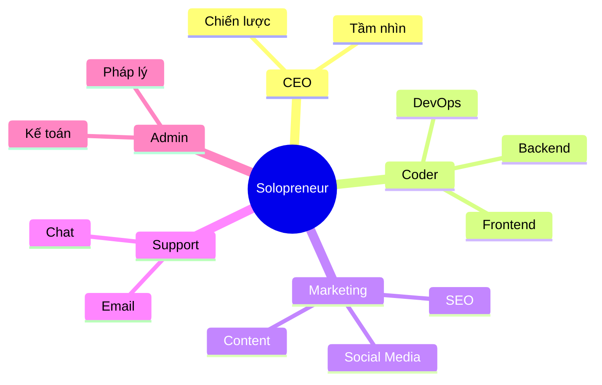

# Hành Trình Solopreneur: Khi Bạn Là Cả Đội Ngũ (Và Cách Để Không Phát Điên)

Chào bạn, người đang ấp ủ giấc mơ tự do! 👋

Nếu bạn đang đọc bài viết này, có lẽ bạn đang đứng trước một ngã rẽ: tiếp tục công việc 9-to-5 ổn định hay lao mình vào con đường "solopreneur" đầy chông gai nhưng cũng đầy hứa hẹn. Hoặc có thể bạn đã ở trên con thuyền này rồi và đang tìm kiếm một chút đồng cảm.

Dù bạn ở đâu, hãy ngồi xuống, pha một tách cà phê (hoặc trà, tùy gu của bạn) và cùng trò chuyện nhé. Xây dựng doanh nghiệp một mình không chỉ là về chiến lược hay công cụ, mà còn là một hành trình khám phá bản thân cực kỳ thú vị.

## Solopreneur: Nghe Thì Oách, Nhưng Thực Tế Là Gì?

Định nghĩa sách vở thì solopreneur là "doanh nhân độc lập". Nhưng với tôi, solopreneur giống như một nghệ sĩ xiếc đang tung hứng 10 quả bóng cùng lúc.

Bạn không chỉ là CEO. Bạn là:
- **Coder** gõ phím lúc 2 giờ sáng.
- **Designer** chỉnh từng pixel logo.
- **Marketer** viết content đến cạn ý tưởng.
- **CSKH** trả lời email khi đang ăn tối.
- Và kiêm luôn cả **tạp vụ** dọn dẹp văn phòng (chính là phòng ngủ của bạn).

Nghe có vẻ đáng sợ nhỉ? Nhưng khoan đã, đừng vội bỏ cuộc!




## Tại Sao Chúng Ta Lại Chọn Con Đường Này?

Bất chấp những khó khăn, tại sao ngày càng nhiều người chọn làm solopreneur?

1.  **Tự Do Tuyệt Đối**: Không ai sếp nào thở vào gáy bạn. Bạn muốn làm việc ở quán cà phê? Được. Muốn nghỉ sáng thứ Hai để đi dạo? Chẳng ai cấm. Quyền kiểm soát cuộc đời nằm trong tay bạn.
2.  **Học Hỏi Tốc Độ Tên Lửa**: Bạn sẽ học được nhiều kỹ năng trong 6 tháng làm solopreneur hơn là 5 năm làm một vị trí cố định. Bạn buộc phải học để tồn tại, và đó là cách học hiệu quả nhất.
3.  **Sở Hữu Trọn Vẹn**: Thành công là của bạn. Lợi nhuận là của bạn. Và quan trọng nhất, niềm tự hào khi nhìn thấy "đứa con tinh thần" lớn lên từng ngày là vô giá.

| Tiêu chí | Đi làm thuê (9-to-5) 🏢 | Solopreneur 🚀 |
| :--- | :--- | :--- |
| **Thu nhập** | Ổn định, có trần | Không ổn định, không giới hạn |
| **Thời gian** | Cố định (8h/ngày) | Linh hoạt (hoặc làm 24/7) |
| **Sếp** | Người khác | Chính bạn (và khách hàng) |
| **Rủi ro** | Thấp | Cao |
| **Học hỏi** | Chuyên môn sâu | Đa năng (Full-stack human) |


## Những Sự Thật "Đắng Lòng" (Và Cách Vượt Qua)

Hãy nói về những góc khuất mà ít ai kể trên mạng xã hội.

### 1. Sự Cô Đơn "Chết Người"
Làm việc một mình đồng nghĩa với việc không có đồng nghiệp để "tám" chuyện, không có những buổi happy hour sau giờ làm.
**👉 Lời khuyên:** Đừng tự giam mình. Hãy tham gia các cộng đồng online (như Indie Hackers, Twitter/X), hoặc xách laptop ra co-working space. Tìm một "accountability partner" (đối tác trách nhiệm) để cùng thúc đẩy nhau.

### 2. Hội Chứng "Kẻ Mạo Danh" (Imposter Syndrome)
"Mình có đủ giỏi không?", "Sản phẩm này có ai cần không?". Những câu hỏi này sẽ ám ảnh bạn.
**👉 Lời khuyên:** Hãy nhớ rằng ai cũng bắt đầu từ con số 0. Ngay cả những chuyên gia hàng đầu cũng từng là người mới. Hãy so sánh bản thân của hôm nay với ngày hôm qua, đừng so sánh với thành công của người khác.

### 3. Kiệt Sức (Burnout) Là Có Thật
Khi ranh giới giữa công việc và cuộc sống bị xóa nhòa, bạn rất dễ làm việc 16 tiếng/ngày mà không hay biết.
**👉 Lời khuyên:** Hãy coi nghỉ ngơi là một nhiệm vụ bắt buộc. Đặt lịch nghỉ ngơi như đặt lịch họp. Sức khỏe là tài sản lớn nhất của solopreneur.

## Bí Kíp "Sống Sót" Cho Người Mới Bắt Đầu

Sau một thời gian "lăn lộn", đây là những bài học xương máu tôi muốn chia sẻ với bạn:

### 🌱 Bắt Đầu Khi Chưa Sẵn Sàng
Đừng đợi đến khi sản phẩm hoàn hảo 100%. Nó sẽ không bao giờ hoàn hảo đâu. Hãy tung ra bản MVP (Sản phẩm khả thi tối thiểu) sớm nhất có thể. Phản hồi của người dùng giá trị hơn ngàn giờ bạn ngồi đoán già đoán non.

### 🎯 Tập Trung Là Siêu Năng Lực
Đừng cố làm mọi thứ cùng lúc. Chọn **MỘT** vấn đề cốt lõi để giải quyết, **MỘT** kênh marketing để tập trung. Sự xao nhãng là kẻ thù số 1.

### 📢 Xây Dựng Công Khai (Build in Public)
Đừng giấu giếm ý tưởng. Hãy chia sẻ quá trình bạn làm việc. Mọi người thích những câu chuyện thật, những thất bại và bài học hơn là những thành công bóng bẩy. Điều này giúp bạn xây dựng tệp khán giả trung thành ngay cả khi chưa có sản phẩm.

### 🤖 Tự Động Hóa Mọi Thứ Có Thể
Thời gian của bạn là vàng. Nếu một việc phải lặp lại quá 3 lần, hãy tìm cách tự động hóa nó.
```javascript
// Tư duy của Solopreneur:
if (task.isRepetitive() && task.timeCost > 5_minutes) {
  automate(task);
} else {
  doIt(task);
}
```

## Lời Kết

Hành trình solopreneur giống như leo núi. Có lúc bạn sẽ thấy mệt mỏi, muốn bỏ cuộc, nhưng khi lên đến đỉnh (hoặc thậm chí chỉ là một trạm nghỉ chân), khung cảnh sẽ tuyệt đẹp.

Bạn không đơn độc trên hành trình này. Hãy cứ đi, cứ sai, và cứ sửa. Mỗi dòng code bạn viết, mỗi nội dung bạn tạo ra đều đang góp phần xây dựng nên đế chế nhỏ bé của riêng bạn.

Hẹn gặp bạn ở đỉnh cao nhé! 🚀

---
*Bạn đang gặp khó khăn gì trong hành trình của mình? Hãy chia sẻ với tôi nhé, chúng ta sẽ cùng gỡ rối!*
