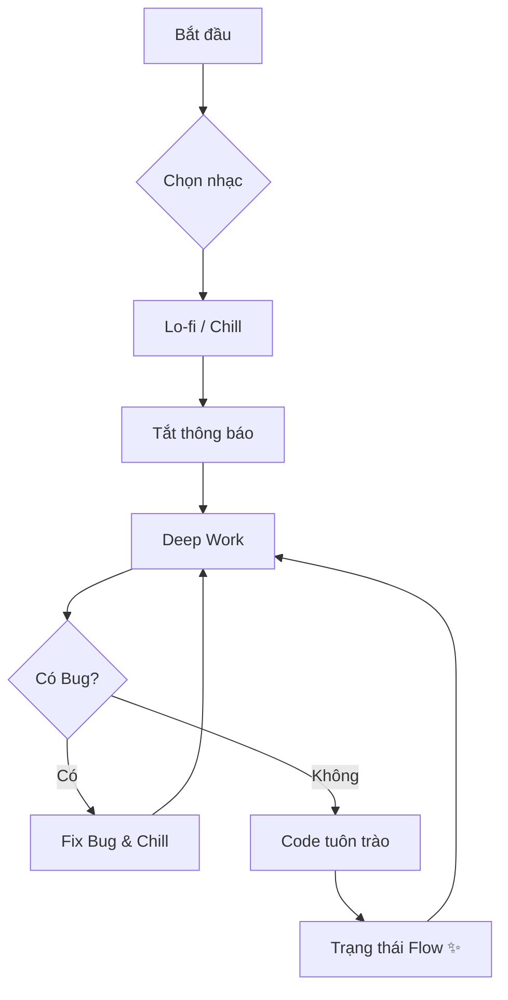

# Vibecoding: Khi Lập Trình Là Nghệ Thuật Của Dòng Chảy ✨

Bạn đã bao giờ ngồi xuống code, đeo tai nghe lên, và bỗng nhiên... 3 tiếng trôi qua như một cái chớp mắt? Bạn không cảm thấy mệt, ngược lại còn thấy phấn chấn, và những dòng code cứ thế tuôn ra như suối?

Đó chính là **Vibecoding**.

## Vibecoding Không Phải Là...
Nó không phải là việc gõ phím nhanh như hacker trong phim.
Nó không phải là việc cố gắng giải thuật toán khó nhất để khoe khoang.
Và chắc chắn nó không phải là việc code trong đau khổ chỉ để kịp deadline.

| Đặc điểm | Lập trình thường 😐 | Vibecoding ✨ |
| :--- | :--- | :--- |
| **Tâm thế** | "Phải làm cho xong" | "Được tạo ra cái gì đó" |
| **Cảm xúc** | Căng thẳng, mệt mỏi | Hứng khởi, Flow |
| **Âm nhạc** | Tạp âm văn phòng | Lo-fi, Synthwave, Jazz |
| **Kết quả** | Code chạy được | Code đẹp, có hồn |


## Vậy Vibecoding Là Gì? 🎧

Vibecoding là trạng thái khi kỹ thuật gặp gỡ cảm xúc. Là khi bạn code không chỉ để "chạy được", mà để cảm thấy "sướng". Đó là sự kết hợp giữa:
1.  **Sự tập trung sâu (Deep Work)**
2.  **Trạng thái dòng chảy (Flow State)**
3.  **Niềm vui sáng tạo (Joy of Creation)**




Hãy tưởng tượng code giống như chơi nhạc. Bàn phím là nhạc cụ, và IDE là sân khấu của bạn.

## Làm Sao Để "Bắt" Được Vibe?

Không cần nến và hoa, nhưng bạn cần chuẩn bị một chút "nghi thức" để mời gọi nàng thơ Vibecoding.

### 1. Thiết Lập Không Gian (The Setup) 🕯️
Đừng coi thường không gian làm việc. Một góc máy gọn gàng, ánh sáng ấm áp (warm light), và một chiếc ghế êm ái có thể thay đổi hoàn toàn tâm trạng của bạn.
*Mẹo nhỏ:* Hãy thử bật chế độ Dark Mode cho mọi thứ. Mắt bạn sẽ cảm ơn bạn đấy.

### 2. Âm Nhạc Là Chìa Khóa (The Soundtrack) 🎵
Nhạc không lời, Lo-fi, Synthwave, hay Jazz? Tùy bạn. Nhưng hãy tạo một playlist riêng cho việc code. Khi nhạc lên, não bộ sẽ tự động hiểu: "À, đến giờ phiêu rồi".

```javascript
const codingPlaylist = {
  mood: 'focus',
  genres: ['lo-fi hip hop', 'ambient', 'synthwave'],
  volume: 40, // Vừa đủ để chill, không quá ồn để mất tập trung
  recommendation: 'Lofi Girl on YouTube'
};
```

### 3. Code Như Kể Chuyện (Code as Poetry) 📝
Hãy viết code sao cho khi đọc lại, bạn thấy nó đẹp như một bài thơ (hoặc ít nhất là một bài văn xuôi mạch lạc).

Thay vì viết:
```python
# Khô khan và khó hiểu
d = get_data()
for i in d:
    if i.s > 10:
        p(i)
```

Hãy thử "thổi hồn" vào nó:
```python
# Rõ ràng và có "tâm"
users = fetch_active_users()

for user in users:
    if user.has_high_score():
        celebrate_achievement(user)
```
Bạn thấy sự khác biệt không? Đoạn code thứ hai không chỉ dễ đọc, nó còn kể cho bạn nghe một câu chuyện về người dùng và thành tựu của họ.

### 4. Tận Hưởng Những "Thắng Lợi Nhỏ" (Small Wins) 🎉
Đừng đợi đến khi xong cả dự án mới ăn mừng.
- Fix được một cái bug khó chịu? **Ăn mừng!** (Làm ngụm cà phê).
- Refactor xong một hàm cho gọn đẹp? **Ăn mừng!** (Vươn vai một cái).
- Code chạy mượt mà trong lần run đầu tiên? **Phép màu!** (Tự thưởng cho mình một chiếc bánh).

## Tại Sao Vibecoding Lại Quan Trọng?

Trong thế giới công nghệ hối hả, chúng ta dễ bị cuốn vào guồng quay của tính năng, bug, và deadline. Chúng ta quên mất lý do ban đầu mình yêu thích lập trình: **Cảm giác được kiến tạo**.

Vibecoding giúp bạn:
- **Giảm stress**: Code trở thành thiền định.
- **Tăng chất lượng**: Khi bạn yêu cái mình làm, bạn sẽ làm nó cẩn thận hơn.
- **Duy trì đam mê**: Bạn sẽ không bị "burnout" nếu mỗi ngày làm việc là một niềm vui.

## Kết Luận

Lần tới khi bạn mở VS Code lên, đừng chỉ lao vào gõ như một cái máy. Hãy hít thở sâu, bật playlist yêu thích, và tự hỏi: *"Hôm nay mình sẽ tạo ra điều gì thú vị?"*.

Hãy để code tuôn chảy theo nhịp điệu của riêng bạn. Đó chính là Vibecoding. ✨

Happy coding & keep the vibe alive!
