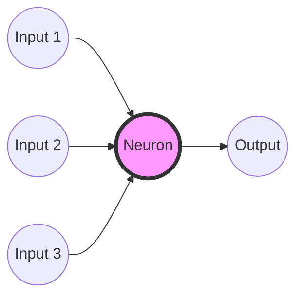

# Neural Networks: Giải Mã Bộ Não Nhân Tạo 🧠

Bạn đã bao giờ tự hỏi làm thế nào Facebook nhận ra mặt bạn trong ảnh? Hay làm sao Google Dịch hiểu được tiếng Việt? Hay chiếc xe tự lái biết dừng lại khi đèn đỏ?

Câu trả lời nằm ở **Neural Networks** (Mạng nơ-ron nhân tạo) - công nghệ cốt lõi đứng sau cuộc cách mạng AI hiện nay.

Nhưng đừng để cái tên "nguy hiểm" đó dọa bạn. Hãy cùng mổ xẻ nó xem bên trong có gì nhé!

## Cảm Hứng Từ Mẹ Thiên Nhiên

Ý tưởng của Neural Networks thực ra rất đơn giản: **"Nếu bộ não con người thông minh đến thế, tại sao ta không thử bắt chước cấu trúc của nó?"**

Bộ não của chúng ta được tạo thành từ hàng tỷ tế bào thần kinh gọi là **Neurons**. Các neuron này kết nối với nhau, truyền tín hiệu điện cho nhau. Khi bạn nhìn thấy một con mèo, một nhóm neuron cụ thể sẽ "phát sáng", báo cho não biết: "A, có con mèo!".

Neural Network trong máy tính cũng vậy. Nó là một mạng lưới các "neuron ảo" được kết nối với nhau bằng các con số.

## Giải Phẫu Một "Neuron Ảo" (Perceptron)

Một neuron nhân tạo hoạt động như một nhà máy xử lý thông tin mini:

1.  **Đầu vào (Ingredients):** Nhận thông tin từ các neuron khác (ví dụ: điểm ảnh của một bức hình).
2.  **Trọng số (Weights):** Đánh giá tầm quan trọng của từng đầu vào. (Ví dụ: Để nhận diện con mèo, hình dáng cái tai quan trọng hơn màu lông nền).
3.  **Tổng hợp (Mixing):** Cộng tất cả lại.
4.  **Hàm kích hoạt (Activation Function):** Người gác cổng quyết định. Nếu tổng tín hiệu đủ lớn, neuron sẽ "bắn" tín hiệu đi tiếp. Nếu không, nó im lặng.

```python
# Tư duy của một Neuron:
def neuron_thinking(inputs):
    importance = calculate_importance(inputs) # Nhân với trọng số
    total_signal = sum(importance)
    
    if total_signal > threshold:
        return "FIRE! 🔥" # Kích hoạt
    else:
        return "Sleep... zzZ" # Không kích hoạt
```




## Mạng Lưới: Sức Mạnh Của Số Đông

Một neuron đơn lẻ chẳng làm được gì nhiều. Nhưng khi bạn kết nối hàng ngàn, hàng triệu neuron lại với nhau thành các **Lớp (Layers)**, phép màu sẽ xảy ra.

Hãy tưởng tượng một dây chuyền lắp ráp:
1.  **Lớp đầu vào (Input Layer):** Nhận các điểm ảnh thô của bức ảnh.
2.  **Các lớp ẩn (Hidden Layers):**
    - Lớp đầu tiên nhận ra các đường nét, cạnh (thẳng, cong).
    - Lớp tiếp theo ghép các nét thành hình dạng (mắt, mũi, tai).
    - Lớp tiếp theo ghép các bộ phận thành khuôn mặt hoàn chỉnh.
3.  **Lớp đầu ra (Output Layer):** Đưa ra kết luận: "Đây là con Mèo (99%)" hay "Đây là con Chó (1%)".

Đây chính là **Deep Learning** (Học sâu) - "Sâu" ở đây là vì nó có nhiều lớp ẩn chồng lên nhau.

## Làm Sao Nó "Học" Được? (Backpropagation)

Ban đầu, mạng nơ-ron như một đứa trẻ sơ sinh, nó đoán bừa.
Nó nhìn ảnh con Mèo và phán: "Đây là cái máy giặt!".

Lúc này, một thuật toán gọi là **Backpropagation** (Lan truyền ngược) sẽ xuất hiện và... "cốc đầu" nó một cái:
*"Sai rồi! Đây là con Mèo. Mày đã sai ở đâu? Hãy điều chỉnh lại các trọng số (weights) đi!"*

Quá trình này lặp lại hàng triệu lần. Đoán -> Sai -> Sửa -> Đoán lại. Dần dần, sai số giảm xuống và mạng trở nên thông minh hơn.

## Các Loại Neural Networks Phổ Biến

Không phải mạng nào cũng giống nhau. Tùy nhiệm vụ mà chúng ta có các kiến trúc khác nhau:

- **CNN (Convolutional Neural Networks):** Chuyên gia về hình ảnh. Dùng để nhận diện khuôn mặt, chẩn đoán y tế qua phim X-quang.
- **RNN / LSTM:** Chuyên gia về chuỗi và trí nhớ. Dùng cho dịch thuật, dự đoán chứng khoán, viết văn.
- **Transformers:** Ngôi sao mới nổi (công nghệ sau ChatGPT). Cực kỳ giỏi trong việc hiểu ngữ cảnh và ngôn ngữ tự nhiên.

| Loại Mạng | Đặc điểm chính | Chuyên trị | Ví dụ |
| :--- | :--- | :--- | :--- |
| **CNN** | Quét từng vùng nhỏ (cửa sổ trượt) | Hình ảnh, Video | Nhận diện khuôn mặt |
| **RNN / LSTM** | Có trí nhớ ngắn hạn | Chuỗi, Thời gian | Dịch thuật, Chứng khoán |
| **Transformers** | Cơ chế "Chú ý" (Attention) | Ngôn ngữ, Ngữ cảnh rộng | ChatGPT, Google Translate |


## Kết Luận

Neural Networks không phải là ma thuật, nó là Toán học thống kê ở quy mô khổng lồ. Nó đang giúp chúng ta giải quyết những bài toán mà lập trình truyền thống bó tay.

Hiểu về nó không chỉ giúp bạn bắt kịp công nghệ, mà còn cho bạn một góc nhìn mới mẻ về chính bộ não của mình.

Lần tới khi bạn mở khóa điện thoại bằng khuôn mặt, hãy thầm cảm ơn những "neuron ảo" đang làm việc chăm chỉ bên dưới nhé! 😉

---
*Bài viết này có làm bạn "nổ não" không? Hãy để lại bình luận nếu bạn muốn tôi giải thích sâu hơn về phần nào nhé!*
