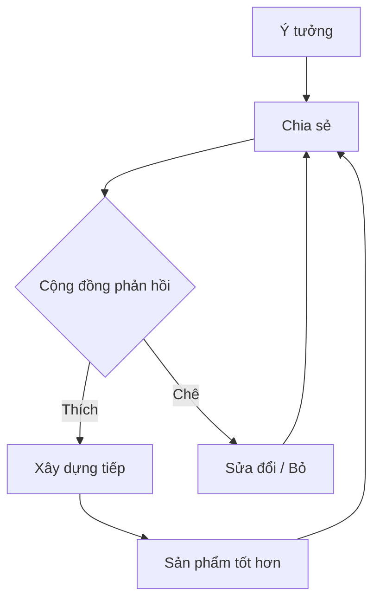

# Xây Dựng Công Khai (Build in Public): Tại Sao Bạn Nên "Vạch Áo Cho Người Xem Lưng"?

Có một lời khuyên kinh doanh cũ rích: *"Hãy giữ bí mật ý tưởng của bạn cho đến khi ra mắt, kẻo bị đối thủ đánh cắp"*.

Thời đại này, lời khuyên đó nên vứt vào sọt rác. 🗑️

Chào mừng bạn đến với kỷ nguyên của **Build in Public** (Xây dựng công khai) - nơi sự minh bạch, chân thực và dễ bị tổn thương (vulnerability) lại chính là vũ khí mạnh nhất của bạn.

## Build in Public Là Cái Gì?

Đơn giản thôi: Thay vì âm thầm làm việc trong hang tối suốt 6 tháng rồi tung ra sản phẩm (và hy vọng ai đó sẽ quan tâm), bạn **chia sẻ toàn bộ hành trình** ngay từ ngày đầu tiên.

| Đặc điểm | Marketing Truyền thống 🕴️ | Build in Public 📢 |
| :--- | :--- | :--- |
| **Thời điểm** | Khi sản phẩm đã hoàn thiện | Ngay từ khi có ý tưởng |
| **Nội dung** | Chỉ khoe cái tốt, giấu cái xấu | Chia sẻ cả thành công và thất bại |
| **Mục tiêu** | Bán hàng (Sales) | Xây dựng niềm tin & Cộng đồng |
| **Chi phí** | Cao (Quảng cáo) | Thấp (Thời gian & Sự chân thành) |

Bạn chia sẻ gì?
- 📈 Những biểu đồ tăng trưởng xanh mướt.
- 📉 Những ngày doanh thu bằng 0 tròn trĩnh.
- 💡 Ý tưởng lóe lên trong lúc tắm.
- 🐛 Cái bug ngớ ngẩn bạn mất 3 ngày mới fix được.
- 😭 Cảm giác muốn bỏ cuộc khi mọi thứ đổ vỡ.

## Tại Sao Lại Phải Làm Thế? (Lợi Ích Không Ngờ)

### 1. Xây Dựng Niềm Tin (Trust) 🤝
Trong một thế giới đầy rẫy lừa đảo và quảng cáo "lùa gà", sự chân thực là vàng. Khi thấy bạn vật lộn, cố gắng và sửa sai, khán giả sẽ tin tưởng bạn là người thật, việc thật. Họ tin vào con người phía sau sản phẩm.

### 2. Marketing Miễn Phí (Free Marketing) 📣
Mỗi bài đăng chia sẻ quá trình là một điểm chạm (touchpoint) với khách hàng tiềm năng. Bạn không cần "bán hàng", bạn đang "kể chuyện". Và ai cũng thích nghe chuyện hay. Đến khi bạn ra mắt sản phẩm, bạn đã có sẵn một lượng fan hâm mộ chờ đợi để mua.

### 3. Nhận Phản Hồi Sớm (Feedback Loop) 🔄
Thay vì đoán xem khách hàng muốn gì, hãy hỏi họ!
*"Tôi định làm tính năng A hay B, các bạn thấy sao?"*
Cộng đồng sẽ cho bạn câu trả lời ngay lập tức. Bạn tránh được việc tốn công xây những thứ chẳng ai cần.

### 4. Tìm Kiếm Đồng Đội và Cơ Hội 🤝
Nhà đầu tư, co-founder, hay nhân viên tài năng thường bị thu hút bởi những người có đam mê và tầm nhìn rõ ràng. Build in Public giống như bạn đang bật một ngọn hải đăng thu hút những người cùng tần số.

## Nhưng... Tôi Sợ! (Những Nỗi Sợ Thường Gặp)

### 😱 "Nhỡ người ta ăn cắp ý tưởng của tôi thì sao?"
Sự thật phũ phàng: **Ý tưởng rẻ bèo, thực thi mới đắt giá.**
Cùng một ý tưởng "Uber cho thú cưng", 100 người nghĩ ra, nhưng chỉ 1 người làm thành công. Đừng lo về việc bị copy, hãy lo về việc không ai biết đến bạn. Hơn nữa, khi bạn chia sẻ công khai, bạn đang khẳng định vị thế "người tiên phong" trong mắt cộng đồng.

### 😰 "Nhỡ tôi thất bại công khai thì sao? Nhục lắm!"
Thất bại là một phần của cuộc chơi. Khi bạn dám chia sẻ thất bại, bạn trở nên dũng cảm và đáng nể trọng hơn. Mọi người sẽ cổ vũ bạn đứng dậy. Và nếu bạn thành công sau thất bại đó? Câu chuyện của bạn sẽ trở thành huyền thoại truyền cảm hứng.

### 🤐 "Tôi chẳng có gì thú vị để chia sẻ cả."
Bạn không cần phải là thiên tài hay triệu phú. Hãy chia sẻ những gì bạn đang học.
*"Hôm nay tôi học cách dùng Docker, khó vãi chưởng nhưng cuối cùng cũng chạy được."* -> Rất nhiều người mới sẽ đồng cảm với bạn.

## Bắt Đầu Như Thế Nào?

Không cần viết blog dài ngoằng đâu. Hãy bắt đầu từ những nơi đơn giản:

1.  **Twitter/X:** Nơi sôi động nhất của cộng đồng Indie Hacker. Hãy tweet về mục tiêu tuần này của bạn.
2.  **LinkedIn:** Chia sẻ những bài học chuyên môn, góc nhìn sâu sắc hơn.
3.  **Indie Hackers / Reddit:** Tham gia các thảo luận, chia sẻ tiến độ hàng tháng.

### Công Thức Bài Đăng Đơn Giản:
1.  **Tôi đã làm gì:** (Mô tả ngắn gọn)
2.  **Tôi gặp khó khăn gì:** (Sự thật trần trụi)
3.  **Tôi đã giải quyết thế nào:** (Giải pháp/Bài học)
4.  **Câu hỏi mở:** (Mời mọi người thảo luận)

## Ví Dụ Thực Tế

> "Tuần này mình định ra mắt tính năng Thanh toán, nhưng Stripe API phức tạp quá, mình loay hoay mãi chưa xong. Có bác nào từng gặp lỗi X này chưa? Cứu mình với! 😭 #buildinpublic #coding"

Đơn giản vậy thôi, nhưng nó tạo ra sự kết nối.

## Kết Luận

Build in Public không chỉ là một chiến thuật marketing. Nó là một cam kết với bản thân về sự minh bạch và nỗ lực không ngừng.

Đừng chờ đến khi thành công mới kể chuyện. Hãy kể chuyện để đi đến thành công.

Bạn đã sẵn sàng "vạch áo" chưa? Hãy chia sẻ mục tiêu ngày hôm nay của bạn ngay dưới phần bình luận nhé! 👇

---
*Hành trình vạn dặm bắt đầu từ một dòng tweet. Hãy để thế giới biết bạn đang làm gì!*
