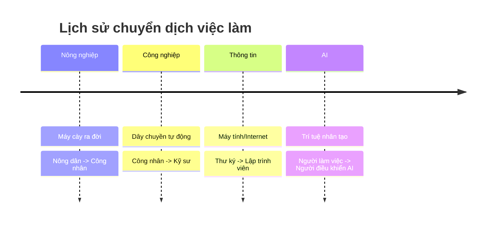

# AI Có Cướp Mất Việc Của Bạn Không? 😱

Sáng mở mắt ra đọc báo: "AI viết code thay lập trình viên", "AI viết báo thay nhà báo", "AI tư vấn luật thay luật sư".
Bạn bắt đầu toát mồ hôi hột: "Thôi xong, sắp thất nghiệp rồi!".

Bình tĩnh nào! Hãy cùng ngồi xuống uống miếng nước và phân tích xem thực hư thế nào nhé.

## Quy Luật Của Lịch Sử 📜

Đây không phải lần đầu tiên con người sợ máy móc.
*   Khi máy cày ra đời, nông dân sợ mất việc. -> Kết quả: Nông dân đỡ khổ hơn, năng suất cao hơn, và con người chuyển sang làm công nghiệp.
*   Khi máy tính ra đời, nhân viên tính toán sợ mất việc. -> Kết quả: Sinh ra hàng triệu công việc mới (IT, thiết kế web, game thủ...).

Lịch sử chứng minh: **Công nghệ không triệt tiêu việc làm, nó chỉ CHUYỂN DỊCH việc làm.**

## AI Sẽ Thay Thế Ai?

AI sẽ không thay thế con người. Nhưng **người biết dùng AI sẽ thay thế người không biết dùng AI.**

Hãy tưởng tượng AI là một cái máy tính siêu mạnh.
*   Nếu bạn là một kế toán chỉ biết cộng trừ nhân chia thủ công -> AI sẽ làm nhanh hơn bạn 1000 lần. Bạn mất việc.
*   Nếu bạn là một kế toán biết dùng AI để phân tích dữ liệu và tư vấn chiến lược tài chính -> Bạn trở thành ngôi sao.

Những việc AI làm tốt: Lặp đi lặp lại, tính toán, tổng hợp thông tin, tra cứu.
Những việc AI dở tệ: Cảm xúc, thấu cảm, sáng tạo đột phá, đàm phán, quản lý con người.

| Tiêu chí | AI làm tốt hơn 🤖 | Con người làm tốt hơn 🧠 |
| :--- | :--- | :--- |
| **Tốc độ** | Siêu nhanh | Chậm |
| **Độ chính xác** | Cao (với dữ liệu có sẵn) | Có thể sai sót |
| **Sáng tạo** | Dựa trên cái cũ | Đột phá, mới lạ |
| **Cảm xúc** | Không có | Thấu cảm, kết nối |
| **Đạo đức** | Theo lập trình | Linh hoạt, nhân văn |

## Bạn Cần Làm Gì Để "Bất Tử"? 🛡️

Để không bị AI "đá đít", hãy tập trung vào những kỹ năng "rất người":

1.  **Tư duy phản biện (Critical Thinking):** AI đưa ra câu trả lời, nhưng bạn phải là người đánh giá xem nó đúng hay sai, có phù hợp đạo đức không.
2.  **Sáng tạo (Creativity):** AI có thể vẽ tranh, nhưng ý tưởng vẽ cái gì là do bạn.
3.  **Trí tuệ cảm xúc (EQ):** AI không biết an ủi, không biết động viên, không biết giải quyết mâu thuẫn giữa các đồng nghiệp.
4.  **Học cách dùng AI:** Đừng chống lại nó. Hãy biến nó thành "đệ tử" của bạn. Học cách ra lệnh (Prompt Engineering) để nó làm những việc nhàm chán cho bạn.

## Kết Luận

Tương lai không phải là **AI vs Con người**.
Tương lai là **AI + Con người**.

Đừng lo lắng về việc bị thay thế. Hãy lo lắng về việc mình có chịu học hỏi để làm chủ công cụ mới hay không. Chiếc máy cày không thay thế người nông dân, nó chỉ biến người nông dân thành người lái máy cày.

Hãy trở thành người lái AI, đừng để AI lái mình! 🚀
