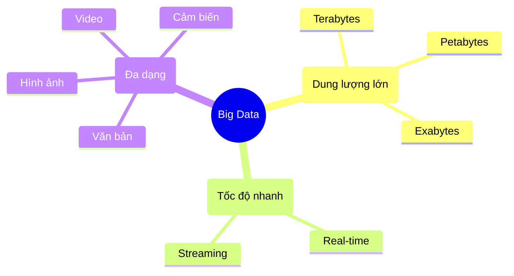

# Big Data: Kho Thóc Khổng Lồ Của Internet 🌾

Người ta hay nói: "Dữ liệu là dầu mỏ mới". Nhưng dầu mỏ thì phải khoan mới có, còn dữ liệu thì... rơi vãi khắp nơi mỗi giây.

Mỗi khi bạn lướt Facebook, thả tim một cái ảnh, xem một video TikTok, hay đặt một cuốc Grab, bạn đang tạo ra dữ liệu. Nhân với 8 tỷ người trên thế giới, chúng ta có một núi dữ liệu khổng lồ. Đó chính là **Big Data**.

## Big Data To Cỡ Nào? 🐘

Hãy tưởng tượng:
*   Nếu 1 byte dữ liệu là một hạt gạo.
*   Thì Big Data hiện nay đủ để lấp đầy cả Thái Bình Dương bằng gạo!

Nó không chỉ **Nhiều** (Volume), mà còn **Nhanh** (Velocity - tăng lên chóng mặt từng giây) và **Đa dạng** (Variety - từ chữ viết, hình ảnh, video đến vị trí GPS).

## Người Ta Làm Gì Với "Kho Thóc" Này?

Ngày xưa, dữ liệu ít, người ta ghi vào sổ tay hoặc Excel là xong. Giờ nhiều quá, phải có siêu máy tính để xử lý.

| Đặc điểm | Dữ liệu truyền thống (Small Data) 📒 | Big Data 🐘 |
| :--- | :--- | :--- |
| **Nơi lưu trữ** | Excel, Sổ sách, Máy tính cá nhân | Cloud, Server khổng lồ |
| **Kích thước** | Nhỏ (Megabytes, Gigabytes) | Siêu lớn (Petabytes trở lên) |
| **Cấu trúc** | Bảng biểu rõ ràng | Lộn xộn (Ảnh, Video, Log) |
| **Xử lý** | Con người có thể đọc | Máy tính mới đọc nổi |

Nhưng thu thập xong để làm gì?

### 1. Hiểu Bạn Hơn Cả Người Yêu
Netflix biết bạn thích phim hành động hay tình cảm. Spotify biết bạn đang buồn hay vui qua bài hát bạn nghe. Shopee biết bạn sắp mua bỉm sữa dù bạn chưa nói với ai (dựa vào lịch sử tìm kiếm).
-> Họ dùng Big Data để **cá nhân hóa** trải nghiệm, khiến bạn "nghiện" dịch vụ của họ hơn.

### 2. Dự Đoán Tương Lai 🔮
Dựa vào dữ liệu quá khứ, máy tính có thể dự đoán:
*   Thời tiết ngày mai mưa hay nắng.
*   Giá cổ phiếu tăng hay giảm.
*   Dịch bệnh sẽ lây lan ra khu vực nào.

### 3. Tối Ưu Hóa Mọi Thứ
Grab dùng Big Data để tính toán đường đi ngắn nhất cho tài xế, giúp bạn đợi xe ít hơn và tài xế tốn ít xăng hơn.

## Mặt Trái Của Tấm Huy Chương 🌑

Big Data mang lại tiện ích, nhưng cũng lấy đi **Sự Riêng Tư**.
Mọi hành động của bạn trên mạng đều để lại "dấu chân số". Các công ty lớn biết bạn đi đâu, làm gì, thích gì, ghét gì.

Đôi khi cảm giác như đang bị theo dõi, đúng không?
Vừa nói chuyện với bạn về "giày chạy bộ", mở Facebook lên thấy ngay quảng cáo giày. Đó không phải trùng hợp, đó là sức mạnh (và sự đáng sợ) của dữ liệu.

## Kết Luận

Big Data là một tài nguyên vô giá. Nó giúp cuộc sống thông minh hơn, tiện lợi hơn. Nhưng hãy là một người dùng thông thái: Biết bảo vệ dữ liệu cá nhân của mình và hiểu rằng "trên mạng không có gì là miễn phí cả".

Chúng ta đang sống trong kỷ nguyên số, hãy học cách bơi trong biển dữ liệu thay vì để nó nhấn chìm nhé! 🌊
