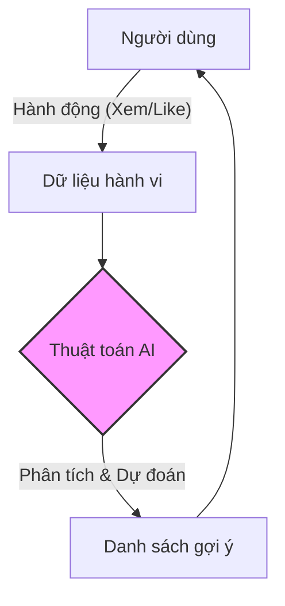

# Tại Sao TikTok Biết Bạn Thích Xem Mèo? (Thuật Toán Gợi Ý) 🐱

Kịch bản quen thuộc:
23:00: "Lướt TikTok 5 phút rồi ngủ."
02:00: Vẫn đang nằm cười khúc khích xem video mèo nhảy hiphop.

Tại sao? Tại sao TikTok (hay YouTube, Facebook) lại biết chính xác bạn muốn xem gì để giữ chân bạn lâu đến thế?
Đó là nhờ **Thuật Toán Gợi Ý (Recommendation Algorithm)**.

## Thuật Toán Là Một Bà Mối Mát Tay 👵❤️

Hãy tưởng tượng TikTok là một bà mối. Bà ấy có hàng tỷ video (các chàng trai/cô gái) và nhiệm vụ của bà là giới thiệu cho bạn video nào mà bạn có khả năng "yêu" (thả tim/xem hết) cao nhất.

Bà mối này quan sát bạn cực kỳ kỹ:

### 1. Bạn Xem Cái Gì? (Nội Dung)
Nếu bạn vừa xem hết một video về nấu ăn, bà mối ghi vào sổ: "Đứa này thích ăn uống". Lần sau bà sẽ đưa thêm video làm bánh, nướng thịt.

### 2. Bạn Xem Bao Lâu? (Thời Gian)
Đây là chỉ số quan trọng nhất.
*   Bạn lướt qua video nhảy nhót trong 1 giây -> "Không thích".
*   Bạn xem video review phim hết 3 phút -> "Rất thích!".
TikTok thà đưa cho bạn video ít like nhưng bạn xem hết, còn hơn video triệu like mà bạn bỏ qua.

### 3. Bạn Tương Tác Thế Nào?
Thả tim, bình luận, chia sẻ, lưu video. Mỗi hành động là một điểm cộng cực lớn cho chủ đề đó.

| Loại tín hiệu | Hành động cụ thể | Mức độ quan trọng |
| :--- | :--- | :--- |
| **Chủ động (Explicit)** | Like, Comment, Share, Follow | Cao (Nhưng ít xảy ra) |
| **Thụ động (Implicit)** | Thời gian xem, Xem lại, Tắt sớm | Rất cao (Dữ liệu thật nhất) |
| **Tiêu cực** | Bấm "Không quan tâm", Chặn, Báo cáo | Cực cao (Tránh ngay lập tức) |

### 4. Những Người Giống Bạn Thích Gì? (Collaborative Filtering)
Bà mối thấy bạn giống với anh A. Anh A thích xem Mèo và Xe hơi. Bạn cũng thích xem Mèo. Vậy khả năng cao bạn cũng sẽ thích Xe hơi. Thế là TikTok thử đưa video Xe hơi cho bạn xem.

## Vòng Lặp Vô Tận (The Loop) ♾️

Thuật toán liên tục thử nghiệm.
Nó ném cho bạn một video lạ hoắc (ví dụ: gốm sứ).
*   Nếu bạn lướt qua -> Nó học: "Không thích gốm".
*   Nếu bạn dừng lại xem -> Nó học: "À ha! Sở thích mới đây rồi".

Càng dùng lâu, thuật toán càng hiểu bạn. Thậm chí nó biết gu của bạn thay đổi theo giờ: Sáng thích xem tin tức, trưa thích xem hài, đêm thích xem đồ ăn đêm (ác thật!).

## Thoát Khỏi "Bong Bóng Lọc" (Filter Bubble) 🫧

Vấn đề là thuật toán chỉ cho bạn xem những gì bạn THÍCH, không phải những gì bạn CẦN.
Nếu bạn thích xem tin tức giật gân, nó sẽ ngập tràn tin giật gân, khiến bạn nghĩ thế giới toàn điều tồi tệ. Đây gọi là "Bong bóng lọc".

**Lời khuyên:**
Thỉnh thoảng hãy chủ động tìm kiếm những chủ đề mới, tích cực. Hãy đánh lừa thuật toán để nó phục vụ mình, thay vì để nó điều khiển cảm xúc của mình.

Hãy nhớ: Bạn là chủ nhân của chiếc điện thoại, đừng để chiếc điện thoại làm chủ nhân của bạn! (Nói thế thôi chứ tối nay tôi lại xem mèo tiếp đây 😹).
