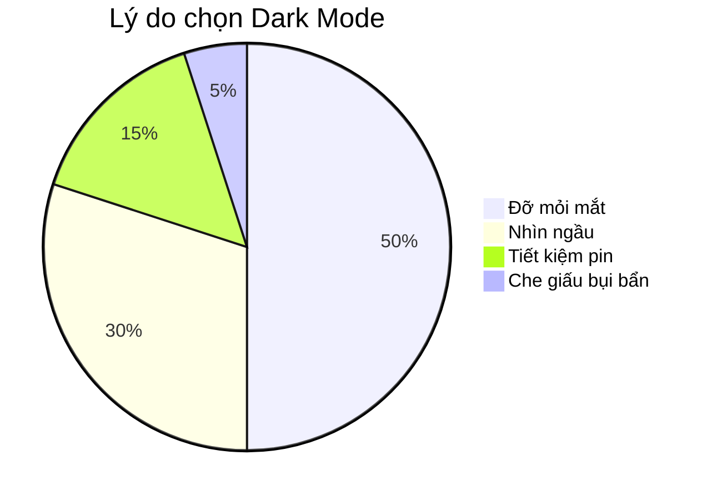

# Dark Mode: Tại Sao Dân IT Lại Cuồng Màu Đen? 🌑

Nếu bạn bước vào một văn phòng công ty công nghệ, bạn sẽ thấy một cảnh tượng quen thuộc: Những căn phòng mờ tối, và trên màn hình máy tính của mọi người đều là một màu đen huyền bí với những dòng chữ xanh đỏ chạy nhảy.

Đó là **Dark Mode** (Chế độ tối).

Tại sao dân IT (và ngày càng nhiều người thường) lại mê mẩn nó đến thế?

## 1. Cứu Rỗi Đôi Mắt 👀

Lập trình viên nhìn màn hình 8-12 tiếng mỗi ngày.
Hãy tưởng tượng nhìn vào một cái bóng đèn trắng (màn hình trắng) suốt 10 tiếng. Mắt bạn sẽ gào thét.
Màn hình đen phát ra ít ánh sáng hơn, độ tương phản dịu hơn, giúp mắt đỡ mỏi hơn hẳn, đặc biệt là khi làm việc vào ban đêm (giờ hoàng đạo của các coder).

## 2. Tiết Kiệm Pin (Cho Màn Hình OLED) 🔋

Với công nghệ màn hình OLED (trên điện thoại xịn và laptop đời mới), màu đen nghĩa là điểm ảnh đó **tắt hoàn toàn**.
Dùng Dark Mode giống như bạn tắt bớt đèn trong nhà vậy. Nó giúp tiết kiệm pin đáng kể.

## 3. Sự Tập Trung (Focus) 🎯

Màn hình trắng rực rỡ làm sáng cả căn phòng, khiến bạn dễ bị phân tâm bởi môi trường xung quanh.
Màn hình đen giúp nội dung (dòng code, văn bản) nổi bật lên, còn mọi thứ khác chìm vào bóng tối. Nó tạo ra cảm giác "đường hầm" giúp bạn tập trung cao độ vào công việc.

## 4. Trông Nó... Ngầu (Cool) 😎

Thú thật đi, giao diện Dark Mode nhìn hiện đại, nguy hiểm và "công nghệ" hơn hẳn. Cảm giác như mình là một hacker trong phim Ma Trận vậy.
Và với Vibecoding, cảm giác (vibe) là quan trọng nhất mà!

## Khi Nào KHÔNG Nên Dùng Dark Mode? ☀️

Tuy nhiên, Dark Mode không phải lúc nào cũng tốt.
Khi bạn ngồi ngoài trời nắng chang chang, hoặc trong phòng quá nhiều ánh sáng, màn hình đen sẽ biến thành cái gương phản chiếu mặt bạn. Lúc này, Light Mode (Chế độ sáng) với độ tương phản cao sẽ giúp bạn đọc dễ hơn nhiều.

| Chế độ | Ưu điểm ✅ | Nhược điểm ❌ | Phù hợp khi |
| :--- | :--- | :--- | :--- |
| **Light Mode** ☀️ | Dễ đọc ngoài trời, quen thuộc | Mỏi mắt ban đêm, tốn pin | Ban ngày, ánh sáng mạnh |
| **Dark Mode** 🌑 | Dịu mắt, tiết kiệm pin, ngầu | Khó đọc khi chói nắng | Ban đêm, phòng tối, Code |

## Kết Luận

Dark Mode không chỉ là trào lưu, nó là một tính năng bảo vệ sức khỏe và tăng năng suất.
Nếu bạn chưa thử, hãy bật Dark Mode trên điện thoại và máy tính ngay hôm nay. Đôi mắt của bạn sẽ cảm ơn bạn đấy!

*P.S. Trang web này cũng có nút chuyển Dark Mode đấy, bạn đã thử bấm chưa?* 😉
