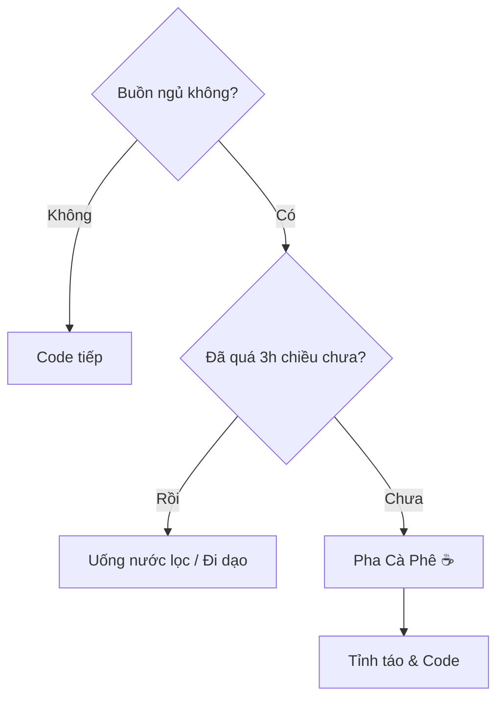

# Cà Phê Và Code: Mối Tình Trăm Năm ☕

Có một định nghĩa vui về Lập trình viên:
> "Programmer: An organism that turns coffee into code."
> (Lập trình viên: Một sinh vật chuyển hóa cà phê thành mã lệnh).

Hình ảnh ly cà phê bốc khói bên cạnh chiếc laptop đã trở thành biểu tượng bất diệt. Tại sao vậy?

## 1. Nút "Bật" Cho Bộ Não 💡

Code là công việc đòi hỏi sự tập trung cao độ và tư duy logic phức tạp.
Caffeine trong cà phê giống như nút "Start" cho bộ não vào buổi sáng (hoặc đêm khuya). Nó chặn cơn buồn ngủ, tăng sự tỉnh táo và giúp các nơ-ron thần kinh "bắn" tín hiệu nhanh hơn.

Không có cà phê -> Não như màn hình chờ (Loading...).
Có cà phê -> Não chạy đa luồng (Multi-threading) vù vù.

## 2. Nghi Thức Của Sự Bắt Đầu (The Ritual) 🧘‍♂️

Pha cà phê không chỉ là để uống. Nó là một nghi thức.
Tiếng máy xay hạt, mùi hương thơm lừng, tiếng nước sôi... Tất cả tạo nên một tín hiệu tâm lý: "Giờ chơi hết rồi, đến giờ làm việc nghiêm túc rồi đây".

Khoảng thời gian 5-10 phút pha chế và nhâm nhi ly đầu tiên là lúc lập trình viên sắp xếp lại suy nghĩ, lên kế hoạch cho ngày làm việc trong đầu.

## 3. Cái Cớ Để Nghỉ Ngơi ⏸️

Khi bí code (stuck), ngồi nhìn màn hình mãi không ra giải pháp.
"Thôi, đi làm ly cà phê đã".
Việc đứng dậy, đi lại, pha chế giúp não bộ được "reset". Rất nhiều ý tưởng thiên tài (Aha moment) xuất hiện chính trong lúc đang đứng chờ máy pha cà phê chứ không phải lúc ngồi gõ phím.

## 4. Văn Hóa Kết Nối 🤝

"Đi cà phê không?" là câu mở đầu cho mọi câu chuyện: từ phỏng vấn xin việc, bàn dự án, đến than thở về ông sếp. Quán cà phê là văn phòng thứ hai, là phòng họp, là nơi giải tỏa stress của dân công nghệ.

## Lời Khuyên Nhỏ

Cà phê tốt, nhưng đừng lạm dụng.
*   Uống quá nhiều -> Tim đập nhanh, tay run (khỏi gõ phím), lo âu.
*   Uống quá muộn -> Mất ngủ -> Sáng sau mệt -> Lại uống cà phê -> Vòng luẩn quẩn.

| Đồ uống | Lượng Caffeine (xấp xỉ) | Tác dụng |
| :--- | :--- | :--- |
| **Espresso (1 shot)** | 63 mg | Tỉnh ngay lập tức |
| **Cà phê phin** | 80-100 mg | Ngấm từ từ, bền bỉ |
| **Trà xanh** | 30 mg | Nhẹ nhàng, thư thái |
| **Nước tăng lực** | 80 mg + Đường | Tỉnh nhanh nhưng hại |

Hãy thưởng thức cà phê như một người bạn đồng hành, đừng biến nó thành ông chủ điều khiển bạn.

Chúc bạn có một ly cà phê ngon và một ngày code không bug! ☕🐛
