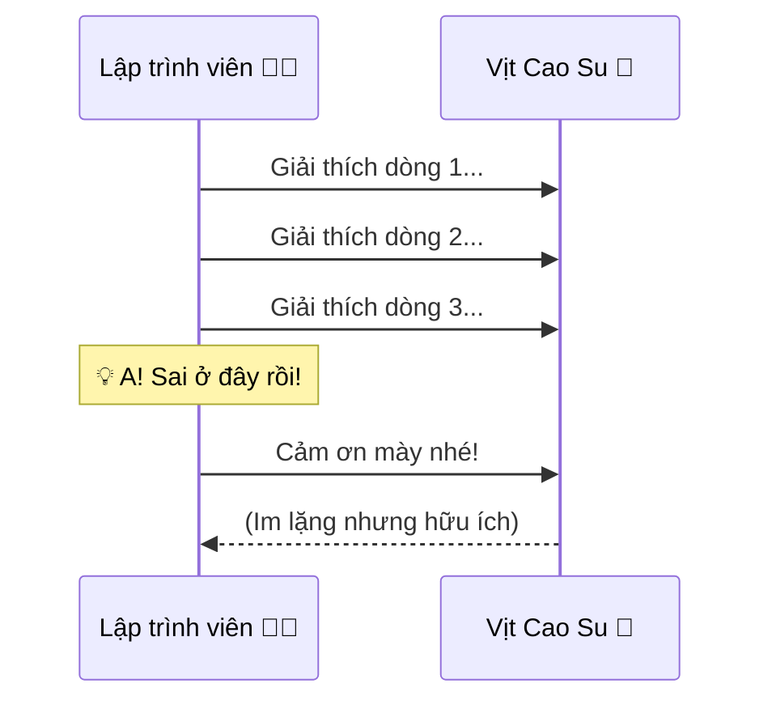

# Gỡ Lỗi Bằng Cách... Nói Chuyện Với Vịt Cao Su? 🦆

Trong giới lập trình có một phương pháp gỡ lỗi (fix bug) huyền thoại tên là **Rubber Duck Debugging** (Gỡ lỗi với vịt cao su).

Nghe có vẻ ngớ ngẩn đúng không? Nhưng nó hiệu quả đến mức kinh ngạc và được ghi vào sách giáo khoa hẳn hoi.

## Chuyện Là Thế Nào?

Khi code bị lỗi, lập trình viên thường vò đầu bứt tai không hiểu sai ở đâu.
Phương pháp này khuyên bạn:
1.  Kiếm một con vịt cao su (hoặc gấu bông, chậu cây, cái cốc...).
2.  Đặt nó lên bàn.
3.  Giải thích cho con vịt nghe dòng code của bạn đang làm gì, từng dòng một, thật chậm rãi và chi tiết.

> "Này Vịt, ở dòng này tao khai báo biến X. Sau đó tao cho vòng lặp chạy từ 1 đến 10. Nếu X lớn hơn 5 thì..."

## Tại Sao Nó Hiệu Quả? 🧠

Điều kỳ diệu thường xảy ra khi bạn đang giải thích dở chừng.
Bỗng nhiên bạn khựng lại: "Khoan đã... Chỗ này sai rồi! Tại sao mình lại để X lớn hơn 5 nhỉ? Phải là nhỏ hơn 5 chứ!".

**Bùm! Tìm ra lỗi.** Con vịt chẳng nói câu nào mà bạn đã tự tìm ra vấn đề.

Lý do là:
*   Khi chúng ta **nghĩ** trong đầu, chúng ta thường nhảy cóc, bỏ qua các chi tiết nhỏ vì não bộ tự cho là "mình hiểu rồi".
*   Khi chúng ta buộc phải **nói ra** (diễn đạt thành lời) cho một đối tượng ngây thơ (như con vịt) hiểu, chúng ta buộc não bộ phải đi chậm lại, soi xét từng chi tiết logic. Và chính lúc này, những lỗ hổng logic lộ diện.

| Trạng thái | Suy nghĩ trong đầu 🧠 | Nói ra thành lời 🗣️ |
| :--- | :--- | :--- |
| **Tốc độ** | Rất nhanh (nhảy cóc) | Chậm rãi (từng bước) |
| **Chi tiết** | Bỏ qua tiểu tiết | Buộc phải chi tiết |
| **Logic** | Chủ quan ("Chắc là đúng") | Khách quan (Kiểm chứng lại) |
| **Kết quả** | Dễ bỏ sót lỗi | Dễ phát hiện lỗi |

## Không Chỉ Dành Cho Coder

Phương pháp này áp dụng được cho mọi ngành nghề.
*   Bạn bí ý tưởng viết văn? Hãy kể lại cốt truyện cho con mèo nghe.
*   Bạn gặp rắc rối trong cuộc sống? Hãy tâm sự to thành tiếng với cái gối.

Việc "ngoại hóa" (externalize) suy nghĩ giúp bạn nhìn vấn đề khách quan hơn, rõ ràng hơn.

## Kết Luận

Đừng ngại bị người khác nhìn với ánh mắt kỳ quặc. Nếu một con vịt nhựa giá 10k có thể giúp bạn tiết kiệm 5 tiếng đồng hồ tìm lỗi, thì nó xứng đáng là đồng nghiệp xuất sắc nhất tháng!

Bạn đã có "chú vịt" của riêng mình chưa? 🦆
