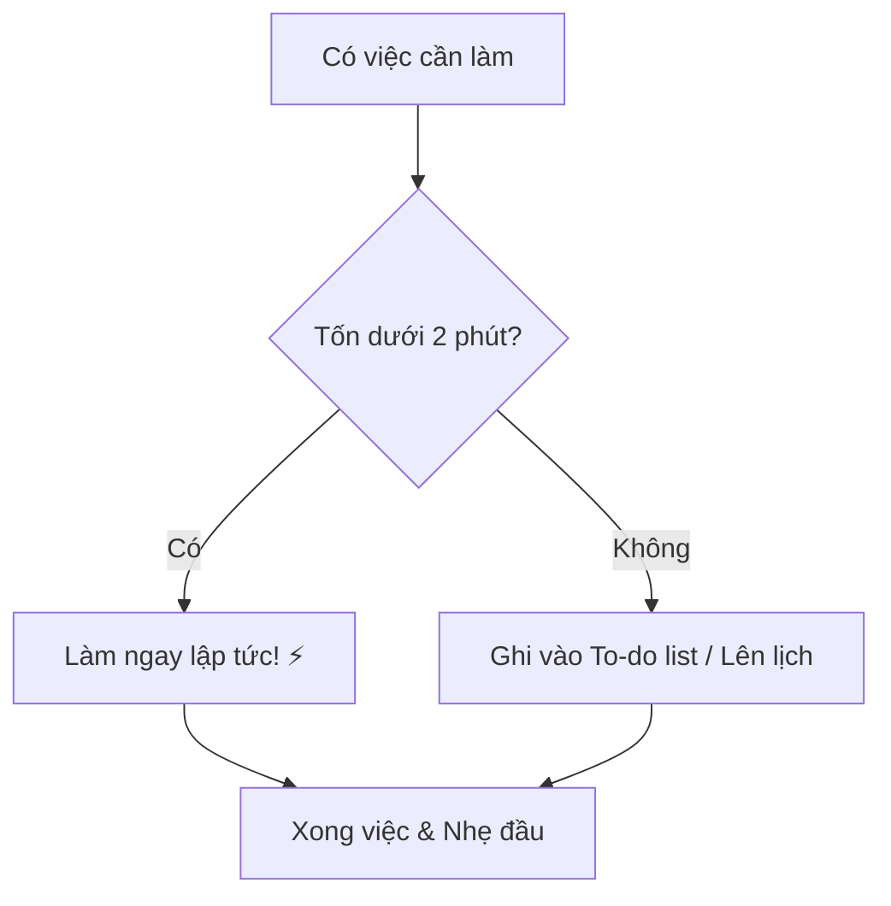

# Kỷ Luật Bản Thân: "Sếp" Khó Tính Nhất Là Chính Mình 🛡️

Khi bạn đi làm công ty:
*   Sáng 8h phải có mặt (không thì bị trừ lương).
*   Deadline sếp giao phải xong (không thì bị mắng).
*   Áp lực đến từ bên ngoài.

Khi bạn làm Solopreneur (làm chủ chính mình):
*   Ngủ đến 10h? Chẳng ai biết.
*   Hôm nay lười không làm? Chẳng ai phạt.
*   Vừa làm vừa xem Netflix? Thoải mái.

Nghe thì sướng, nhưng đây chính là "nấm mồ" chôn vùi nhiều giấc mơ khởi nghiệp. Khi không có áp lực bên ngoài, bạn phải tự tạo áp lực từ bên trong. Đó là **Kỷ Luật**.

## Tại Sao Kỷ Luật Lại Khó? 😫

Vì não bộ con người được lập trình để thích sự thoải mái (Comfort Zone).
Nó thích lướt TikTok hơn là viết code. Nó thích ngủ nướng hơn là tập thể dục.
Kỷ luật là cuộc chiến chống lại bản năng tự nhiên của chính mình.

| Đặc điểm | Động lực (Motivation) 🔥 | Kỷ luật (Discipline) 🛡️ |
| :--- | :--- | :--- |
| **Nguồn gốc** | Cảm xúc nhất thời | Cam kết lý trí |
| **Độ bền** | Nhanh đến nhanh đi | Bền bỉ, dài lâu |
| **Phụ thuộc** | Tâm trạng (Vui mới làm) | Thói quen (Buồn cũng làm) |
| **Kết quả** | Bùng nổ ngắn hạn | Thành công dài hạn |

## Bí Kíp Rèn Luyện Kỷ Luật (Dành Cho Người Lười)

Đừng cố gắng trở thành người sắt ngay lập tức. Hãy bắt đầu nhỏ.

### 1. Quy Tắc 2 Phút ⏱️
Nếu một việc tốn dưới 2 phút để làm (trả lời email, dọn cái cốc, ghi chú ý tưởng), hãy làm ngay lập tức. Đừng trì hoãn.
Cảm giác hoàn thành những việc nhỏ sẽ tạo đà (momentum) để làm việc lớn.

### 2. Thiết Kế Môi Trường (Environment Design) 🏠
Đừng tin vào ý chí. Ý chí có hạn, còn cám dỗ thì vô hạn.
*   Muốn bớt xem điện thoại? Vứt nó sang phòng khác khi làm việc.
*   Muốn tập trung code? Đeo tai nghe chống ồn vào.
*   Muốn ăn healthy? Đừng mua bim bim để trong tủ lạnh.

Làm cho thói quen tốt trở nên **dễ dàng** và thói quen xấu trở nên **khó khăn**.

### 3. Tha Thứ Cho Bản Thân (Nhưng Đừng Nuông Chiều) ❤️
Hôm nay bạn lỡ lười biếng? Đừng tự dằn vặt "Mình thật vô dụng".
Dằn vặt chỉ làm bạn stress và càng lười hơn.
Hãy chấp nhận: "Ok, hôm nay mình hơi tệ. Mai mình sẽ làm lại tốt hơn".
Ngã ở đâu đứng dậy ở đó. Quan trọng là không bỏ cuộc.

## Tự Do Đích Thực

Jocko Willink (cựu đặc nhiệm Mỹ) có câu nói nổi tiếng: **"Discipline equals Freedom"** (Kỷ luật bằng Tự do).

Nghe mâu thuẫn nhỉ? Kỷ luật là gò bó mà?
Không.
*   Có kỷ luật tài chính -> Bạn có tự do tiền bạc.
*   Có kỷ luật sức khỏe -> Bạn có tự do làm điều mình thích mà không lo bệnh tật.
*   Có kỷ luật thời gian -> Bạn hoàn thành việc sớm và có tự do để chơi.

Kỷ luật không phải là nhà tù. Kỷ luật là chìa khóa mở cánh cửa tự do thực sự. Hãy làm ông sếp khó tính của chính mình nhé! 💪
