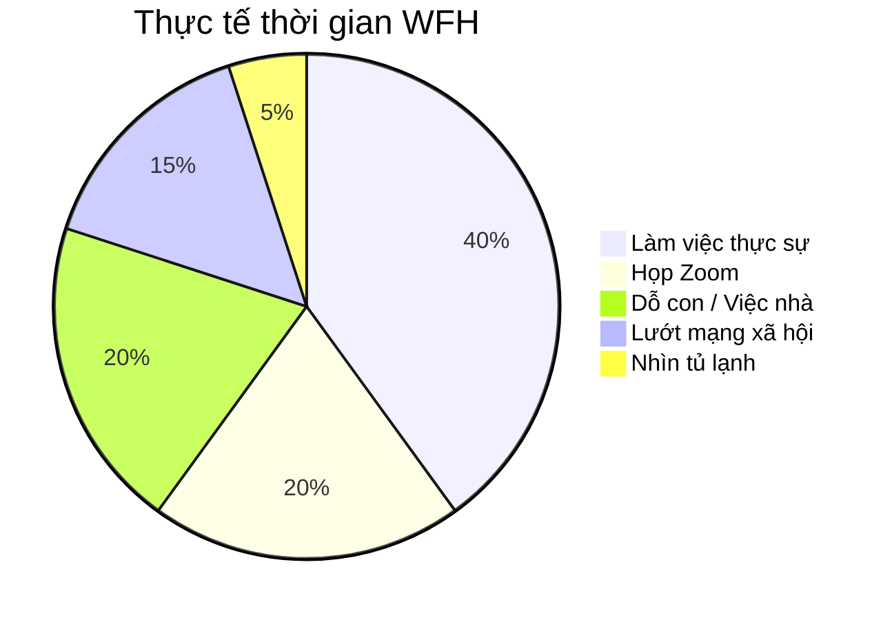

# Làm Việc Tại Nhà (WFH): Tự Do Hay Tự Lo? 🏠

Kể từ sau đại dịch, Work From Home (Làm việc tại nhà) trở thành xu hướng.
Hình ảnh lý tưởng: Ngồi bên cửa sổ, nhâm nhi cà phê, vuốt ve con mèo, gõ vài dòng code và tiền ting ting về tài khoản.

Thực tế phũ phàng:
*   Vừa họp Zoom vừa dỗ con khóc.
*   Hàng xóm hát karaoke "Đắp mộ cuộc tình".
*   Làm việc từ 8h sáng đến 10h đêm không dứt ra được.
*   Tủ lạnh vẫy gọi cứ 15 phút một lần.

## Cái Bẫy Của Sự "Linh Hoạt" 🕸️

Ở văn phòng, ranh giới rất rõ ràng: Đến công ty là làm, về nhà là nghỉ.
Ở nhà, ranh giới bị xóa nhòa.
Bạn cảm thấy tội lỗi khi nghỉ ngơi ("Mình nên làm thêm chút nữa").
Bạn cảm thấy tội lỗi khi làm việc ("Mình nên dành thời gian cho gia đình").
Kết quả: Bạn luôn trong trạng thái lơ lửng, không làm ra làm, chơi ra chơi.

| Tiêu chí | Văn phòng (Office) 🏢 | Làm tại nhà (WFH) 🏠 |
| :--- | :--- | :--- |
| **Đi lại** | Tốn thời gian, kẹt xe | 0 phút (từ giường ra bàn) |
| **Tập trung** | Bị đồng nghiệp làm phiền | Bị người nhà/việc nhà làm phiền |
| **Giờ giấc** | Cố định (9-to-5) | Linh hoạt (hoặc làm 24/7) |
| **Trang phục** | Lịch sự, chỉn chu | Quần đùi, áo phông |

## Chiến Thuật Sinh Tồn Khi WFH 🛠️

Để không bị WFH "nuốt chửng", bạn cần chiến thuật:

### 1. Mặc Đồ Như Đi Làm 👔
Đừng mặc đồ ngủ ngồi vào bàn làm việc.
Việc thay quần áo gửi tín hiệu cho não: "Chuyển chế độ! Giờ là giờ làm việc". Chiều xong việc, thay đồ ở nhà -> Não hiểu: "Xả hơi thôi".

### 2. Góc Làm Việc Riêng Biệt 🚧
Đừng làm việc trên giường hay bàn ăn (nếu có thể).
Hãy có một cái bàn riêng. Khi ngồi vào đó là chỉ làm việc. Khi rời khỏi đó là ngắt kết nối.

### 3. Giờ "Đóng Cửa" 🚪
Đặt báo thức lúc 6h chiều. Khi chuông reo, tắt máy tính. Chấm hết.
Công việc không bao giờ hết, nhưng năng lượng của bạn thì có hạn.

### 4. Giao Tiếp Với Loài Người 🗣️
WFH rất cô đơn. Hãy chủ động gọi điện cho đồng nghiệp, bạn bè. Ra ngoài đi dạo, hít thở khí trời. Đừng biến mình thành người rừng.

## Kết Luận

WFH là một đặc quyền tuyệt vời nếu bạn biết cách kiểm soát nó. Nó cho bạn sự tự do để sắp xếp cuộc sống, nhưng cũng đòi hỏi bản lĩnh để tự quản lý chính mình.

Hãy tận hưởng sự tự do, nhưng đừng quên kỷ luật nhé!
