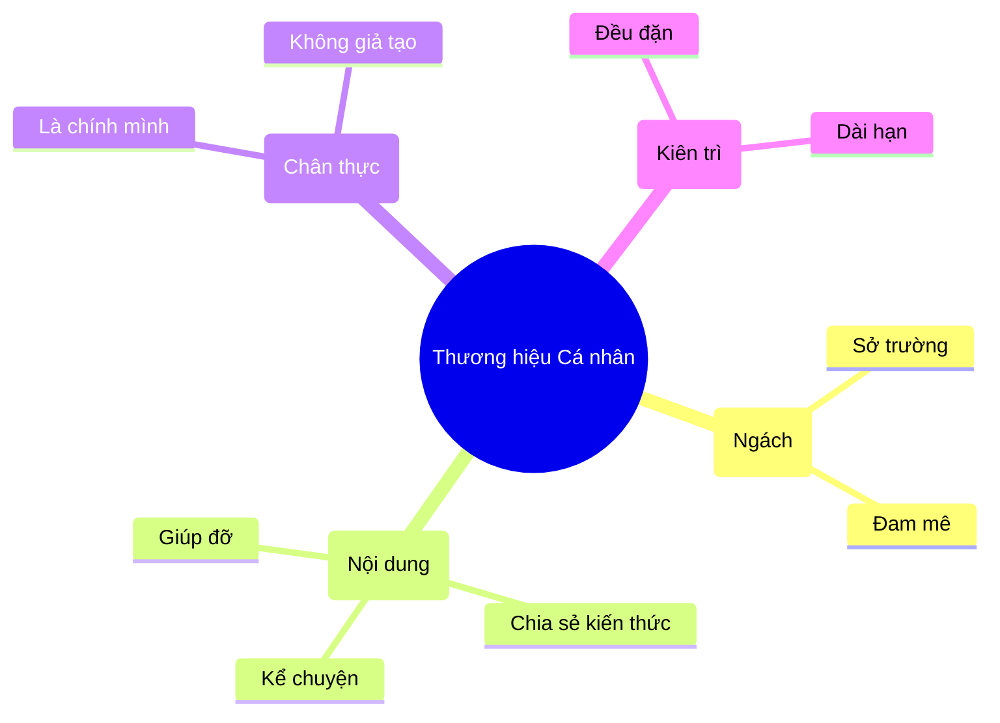

# Thương Hiệu Cá Nhân: Bạn Là Ai Trên Internet? 🌟

Jeff Bezos (ông chủ Amazon) từng nói:
> "Thương hiệu cá nhân là những gì người ta nói về bạn khi bạn không có mặt ở trong phòng."

Trên Internet cũng vậy. Khi ai đó Google tên bạn, họ thấy gì?
*   Một trang Facebook toàn bài than vãn?
*   Một trang LinkedIn trống trơn?
*   Hay một Blog chia sẻ kiến thức thú vị (như cái bạn đang đọc nè)?

Đó chính là thương hiệu cá nhân của bạn.

## Tại Sao Cần Xây Dựng Thương Hiệu? 🚀

Nhiều người nghĩ: "Mình chỉ là nhân viên quèn/sinh viên, cần gì thương hiệu". Sai lầm to!

1.  **Cơ hội tự tìm đến:** Thay vì vất vả đi rải CV xin việc, các nhà tuyển dụng/khách hàng sẽ tự tìm đến bạn vì họ đã biết bạn giỏi qua những gì bạn chia sẻ.
2.  **Tăng giá trị bản thân:** Cùng một kỹ năng code, nhưng người có thương hiệu (được biết đến là chuyên gia) sẽ được trả lương cao gấp đôi người âm thầm làm việc.
3.  **Kết nối:** Bạn sẽ thu hút những người cùng tần số, mở rộng mối quan hệ chất lượng.

| Lầm tưởng (Myth) ❌ | Sự thật (Fact) ✅ |
| :--- | :--- |
| Phải nổi tiếng mới cần làm | Ai cũng cần (để xin việc, thăng tiến) |
| Phải sống ảo, khoe khoang | Chia sẻ giá trị thực tế |
| Phải là chuyên gia số 1 | Chia sẻ quá trình học hỏi cũng tốt |
| Tốn nhiều thời gian | Chỉ cần đều đặn mỗi ngày một chút |

## Xây Dựng Thế Nào? (Không Cần Phải Sống Ảo)

Xây dựng thương hiệu không phải là chụp ảnh sang chảnh, khoe xe khoe tiền.
Nó là việc **Chia sẻ giá trị**.

### 1. Chọn "Ngách" Của Bạn (Niche)
Bạn giỏi cái gì? Bạn thích cái gì?
*   Lập trình React?
*   Thiết kế UI/UX?
*   Nuôi mèo?
*   Nấu ăn?
Hãy chọn một chủ đề và tập trung vào nó. Đừng cố gắng làm chuyên gia của mọi thứ.

### 2. Chia Sẻ Những Gì Bạn Biết (Share Your Knowledge) 📚
Đừng đợi đến khi thành chuyên gia mới chia sẻ. Hãy chia sẻ quá trình bạn học.
*   Học được một mẹo Excel hay? Viết bài chia sẻ.
*   Fix được một cái lỗi code khó chịu? Viết bài hướng dẫn.
*   Đọc được cuốn sách hay? Viết review.

Giúp đỡ người khác giải quyết vấn đề là cách nhanh nhất để xây dựng uy tín.

### 3. Hãy Là Chính Mình (Be Authentic) 🦄
Đừng cố bắt chước giọng văn của người khác. Hãy viết như cách bạn nói chuyện.
Sự chân thật luôn có sức hút nhất. Người ta thích kết nối với một con người có cảm xúc, có sai lầm, hơn là một hình tượng hoàn hảo nhưng giả tạo.

### 4. Kiên Trì (Consistency) 🐢
Đừng viết 1 bài rồi biến mất 3 tháng.
Hãy xuất hiện đều đặn. Mỗi tuần 1 bài viết, 1 video, hay thậm chí 1 dòng tweet. Mưa dầm thấm lâu.

## Kết Luận

Trong kỷ nguyên số, **Bạn chính là công ty truyền thông của chính mình**.
Đừng để hồ sơ online của bạn bám bụi. Hãy bắt đầu xây dựng thương hiệu ngay hôm nay bằng một bài chia sẻ nhỏ.

Bạn là một ngôi sao, hãy tỏa sáng theo cách của riêng mình! ✨
